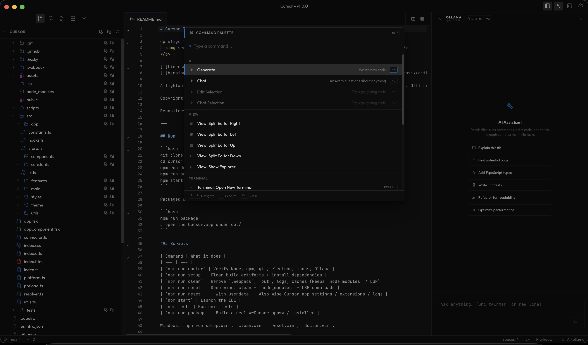

# Cursor IDE

<p align="center">
  
</p>

[](LICENSE)
[](https://github.com/Suryanshu-Nabheet/cursor)

A modern, high-performance Electron + CodeMirror 6 IDE built with TypeScript and React. Features an enterprise-grade AI Sidebar agent, full workspace context indexing, LSP language integration, integrated terminal, and OpenVSX extension management.

Copyright (c) 2026 Suryanshu Nabheet. MIT License.

Repository: [github.com/Suryanshu-Nabheet/cursor](https://github.com/Suryanshu-Nabheet/cursor)

---

## Key Features

-   **Enterprise AI Agent Sidebar**: Live streaming responses, plan generation, thinking execution logs, and autonomous tool calling (`edit_file`, `read_file`, `run_terminal_command`).
-   **Context Mentions (`@`)**: Attach `@file`, `@git:diff`, `@workspace`, `@codebase`, `@terminal`, or `@docs` directly into prompt turns with automatic context injection.
-   **Pure GUI Settings**: Configure AI providers, API keys, models, themes, keybindings, and editor settings directly within the app UI — no `.env` files required.
-   **Language Server Protocol (LSP)**: Built-in LSP integration for intelligent code autocompletion, diagnostics, and hover definitions.
-   **Integrated Terminal**: Fully-featured terminal emulator supporting shell commands and background tasks.
-   **Native macOS Branding**: Dock branding as **Cursor** with custom high-resolution app icon and native macOS menu integrations.

---

## Quick Start

```bash
git clone https://github.com/Suryanshu-Nabheet/cursor.git
cd cursor
npm run doctor         # Check local environment & toolchain
npm run setup          # Clean artifacts and install dependencies
npm start              # Launch Cursor IDE
```

### Packaged Desktop App

```bash
npm run package        # Build standalone Cursor.app under out/
```

---

## Development & Utility Scripts

| Command                            | Description                                                        |
| ---------------------------------- | ------------------------------------------------------------------ |
| `npm start`                        | Launch the Cursor IDE in development mode                          |
| `npm run doctor`                   | Verify Node.js, npm, Git, Electron, icons, and Ollama installation |
| `npm run setup`                    | Clean build artifacts and install project dependencies             |
| `npm run clean`                    | Remove `.webpack`, `out`, logs, and temporary caches               |
| `npm run reset`                    | Deep wipe: clean build + `node_modules` + LSP binaries             |
| `npm run reset -- --with-userdata` | Complete reset including app settings, extensions, and logs        |
| `npm test`                         | Run the automated Jest test suite                                  |
| `npm run package`                  | Package a production **Cursor.app** distribution bundle            |

_Windows PowerShell alternatives: `npm run setup:win`, `clean:win`, `reset:win`, `doctor:win`._

---

## Keyboard Shortcuts

| Action                 | Shortcut                                             |
| ---------------------- | ---------------------------------------------------- |
| AI Chat Sidebar        | `Cmd/Ctrl + L`                                       |
| AI Inline Command Bar  | `Cmd/Ctrl + K`                                       |
| Quick Open File Search | `Cmd/Ctrl + P` _(Blocked on Welcome Screen)_         |
| Command Palette        | `Cmd/Ctrl + Shift + P` _(Blocked on Welcome Screen)_ |
| Global Search          | `Cmd/Ctrl + Shift + F`                               |
| Toggle Terminal        | `` Ctrl + ` ``                                       |
| Inline Autocompletion  | `Cmd/Ctrl + Shift + Space` or `Alt + \`              |

---

## Technology Stack

-   **Framework**: Electron + React 18 + Redux Toolkit
-   **Editor**: CodeMirror 6 + TypeScript
-   **Styling**: Vanilla CSS Design System + Tailwind CSS
-   **AI Engine**: Ollama (local default), OpenAI, Anthropic Claude, Google Gemini, OpenRouter
-   **Testing**: Jest + ts-jest

---

## Project Structure

| Directory / File             | Purpose                                                                     |
| ---------------------------- | --------------------------------------------------------------------------- |
| `src/main/`                  | Electron main process, window management, IPC handlers, app icon            |
| `src/components/`            | React UI components (AI Chat Sidebar, Editor, Filetree, Terminal, Settings) |
| `src/features/`              | Redux slices, AI provider tools, context resolvers, LSP integration         |
| `forge.config.js`            | Electron Forge packaging configuration & Dock branding                      |
| `webpack.main.config.js`     | Webpack build configuration for Electron main process                       |
| `webpack.renderer.config.js` | Webpack build configuration for React UI renderer                           |
| `webpack.rules.js`           | Shared loaders (TypeScript, Babel, React, native modules)                   |
| `tsconfig.json`              | TypeScript compiler configuration                                           |

---

## License

Copyright (c) 2026 Suryanshu Nabheet. Distributed under the [MIT License](LICENSE).
